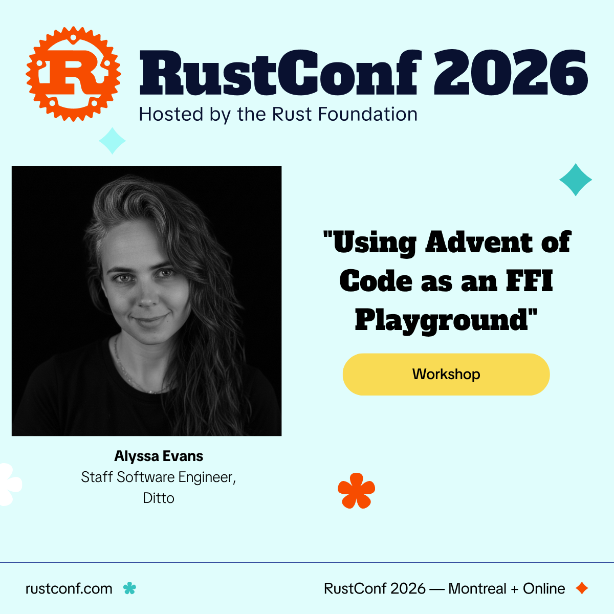

# Workshop Setup Guide



**Using Advent of Code as an FFI Playground** · RustConf 2026 · Tuesday, September 8, 9:00 AM–12:30 PM · Montreal

You'll build a working Rust FFI library from scratch: wrap a real Advent of
Code solution in a C glue layer, then call it from a language of your choice.
You'll leave with a working multi-language project, a replicable methodology,
and hands-on intuition for the pitfalls that make production FFI hard.

Everything below takes about 20 minutes. Doing it **before you travel** means
you spend the workshop writing FFI, not fighting installers on venue Wi-Fi.

---

## 1. Required toolchain

Five tools, and that's the whole contract: `rustc`, `cargo`, `cbindgen`, a C
compiler, and [`just`](https://github.com/casey/just). One file declares them
— [`shell.nix`](./shell.nix) — and the shortest path is to let Nix read it
rather than installing five things by hand.

Pick **one** of these:

**Nix — macOS and Linux, the recommended path.** Install Nix with the
[Determinate installer](https://install.determinate.systems):

```bash
curl --proto '=https' --tlsv1.2 -sSf -L https://install.determinate.systems/nix | sh -s -- install
```

(The [upstream installer](https://nixos.org/download) works too.) Then open a
new shell, `cd` into the repo, and run `nix-shell`. The first run downloads
the toolchain; after that it's instant. Optional but pleasant: install
[direnv](https://direnv.net) with
[nix-direnv](https://github.com/nix-community/nix-direnv) and run
`direnv allow` once — that's what [`.envrc`](./.envrc) is for, and the
environment then loads on its own every time you enter the repo.

**Windows — WSL2, then Nix.** Nix doesn't run natively on Windows, but WSL2
is Linux and Linux is fine. Run `wsl --install` in an **administrator**
PowerShell and reboot ([Microsoft's guide](https://learn.microsoft.com/windows/wsl/install);
if it errors, virtualization needs enabling in BIOS/Windows Features), then
follow the Nix path from inside Ubuntu. If the Nix installer complains about
systemd, add `[boot]` / `systemd=true` to `/etc/wsl.conf`, `wsl --shutdown`,
and reopen. Clone the repo *inside* WSL (`~/RustConf2026`), not under
`/mnt/c` — the filesystem bridge is slow enough to hurt.

**Docker — the devcontainer.** Nothing installed on your machine at all.
Install [Docker](https://docs.docker.com/get-docker/) and
[VS Code](https://code.visualstudio.com) with the
[Dev Containers extension](https://marketplace.visualstudio.com/items?itemName=ms-vscode-remote.remote-containers),
open the repo, and choose **"Reopen in Container"**. VS Code shows a picker —
**"FFI playground (git)"** is the standard choice; **"(jj)"** is the identical
container with [Jujutsu](https://jj-vcs.github.io) added. The first build
installs Nix and home-manager inside the container
([`.devcontainer/`](./.devcontainer) has the details) and takes a few minutes;
later opens are fast. Note that Docker Desktop on Windows itself needs WSL2 or
Hyper-V, so if your machine can't enable virtualization (common on
locked-down corporate laptops), skip to the pairing plan in step 2 — one
working environment per pair is plenty.

**💀 Entirely manual.** No Nix, no Docker, just you and your package manager.
Install all five yourself: [rustup](https://rustup.rs) for `rustc`/`cargo`,
`cargo install cbindgen` (0.28 or newer — `just check` verifies), a C compiler (macOS: `xcode-select --install` ·
Linux: `sudo apt install build-essential`, or
`dnf groupinstall "Development Tools"`), and `just` via `cargo install just`,
brew, or a [release binary](https://github.com/casey/just/releases) — it
needs **≥ 1.31**, and apt/dnf ship older versions that cannot parse this
repo's justfile. Versions are on you: `shell.nix` is unpinned, so the Nix
paths track your channel, but at least they agree with each other. This works;
it's just the option where drift is your problem.

**Rust experience:** you should be comfortable writing basic Rust (functions,
structs, error handling). Deep expertise is *not* required, and neither is
any prior FFI experience — that part is the workshop's job.

**A laptop and its charger.** There's power at every seat, but bring the
charger.

## 2. Clone and self-check

```bash
git clone https://github.com/alycda/RustConf2026.git
cd RustConf2026
just check
```

`just check` is the front door — it runs
[`scripts/self-check.sh`](scripts/self-check.sh), which verifies the required
toolchain (Rust, C compiler **and** linker, `cbindgen`) by compiling and
linking a real C executable, since a broken SDK path hides happily behind an
installed compiler. It then reports which optional language tracks are ready.
All required rows green means step 1 is done. If a row is red, the message
names the specific fix — re-run until green.

Can't get to green? Don't burn an evening on it. **Pairing works**: one
working environment per pair is plenty, and setup triage is the first thing
we do in the room.

## 3. Pick ONE language track

Exercise 3 calls your Rust library from a higher-level language. Pick
**exactly one** track before arriving — you do not need them all. Each has a
`just` recipe that does the install, or points you at the one installer it
can't run unattended:

```bash
just setup-python   # Python 3.10+ and cffi, in a repo-local .venv
just setup-swift    # swiftc — Xcode CLT on macOS, swift.org on Linux
just setup-kotlin   # Kotlin/JNA — JDK 17+ and kotlinc (brew on macOS, sdkman on Linux)
just setup-dart     # Dart SDK 3.0+ — brew tap on macOS, dart.dev on Linux
```

After `just setup-python`, activate the venv with `source .venv/bin/activate`
so the next `just check` sees it. (💀 manual-setup folks: `shell.nix` isn't
feeding you a `python3`, so bring your own, 3.10+.) The Kotlin and Dart tracks
also have dedicated devcontainer variants in the "Reopen in Container" picker
if you'd rather not install a JDK or the Dart SDK locally.

"Enough to read simple function calls" is all the fluency the track needs.
Not sure? Python is the shortest install; Swift is free if you're on a Mac.
`just check` reports track readiness in its second section.

## 4. Advent of Code account + your inputs

The puzzles come from [Advent of Code](https://adventofcode.com):

1. Create an account (or log in) at adventofcode.com.
2. Browse the workshop's day menu: [`days/README.md`](days/README.md).
3. **Download your puzzle inputs now** for any days you might pick — inputs
   require login, and venue Wi-Fi on workshop morning is not a plan.
4. Drop each one at `inputs/<YYYY-MM-DD>.txt` — the `inputs/` folder at the
   **repo root**, not the one under `days/`. It's git-ignored except for its
   `.gitkeep`, so your inputs stay out of the repo by construction — AoC asks
   that real inputs and puzzle text never be republished
   ([their FAQ](https://adventofcode.com/about#faq_copying)). Keep them off
   the projector too. The exercises use the small *examples* from the puzzle
   statements, which are fine to share.

Inputs are read at runtime rather than baked in with `include_str!`, so
everything still builds and tests before you've downloaded a single one.

## 5. Cache your dependencies (2 minutes)

While you're home on good internet:

```bash
just days verify
```

That builds and tests the day library, caching every crate the workshop needs
so nothing depends on conference bandwidth. `just` on its own lists the rest
of the recipes.

## 6. Optional prework

If you want a head start, pick your day from the menu and solve it in plain
Rust before you arrive — no FFI, no C, just the parsing and the answer. The
exercise scaffold that gives this a home in the repo ships with the workshop
materials; until then a scratch cargo project is fine. Arriving with it done
means you start the C boundary work early or help a neighbor (both count).

And no, doing it early doesn't spoil anything: the workshop's value is the
*boundary* — the C glue, the bindings, and the facilitated debugging when
they misbehave. That part only happens in the room.

## 7. A note on AI

AI assistance is welcome during the workshop — the goal is understanding the
boundary, not typing speed. Ground rules and an honest account of what AI did
and didn't build in this repo come with the workshop materials.

---

**Checklist before you travel:**

- [ ] `just check` prints green on the required rows
- [ ] One language track chosen and installed
- [ ] AoC account created, inputs downloaded to `inputs/` at the repo root
- [ ] `just days verify` run once (deps cached)
- [ ] (Optional) your chosen day solved in plain Rust

Questions or a setup problem you can't crack?
[Open an issue](https://github.com/alycda/RustConf2026/issues) — it's
monitored through the workshop. Do it before the session rather than during
it; a broken environment is much cheaper to fix the day before.

See you in Montreal!
