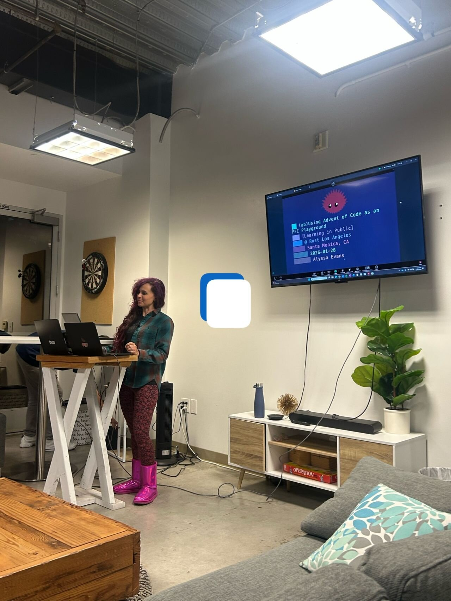
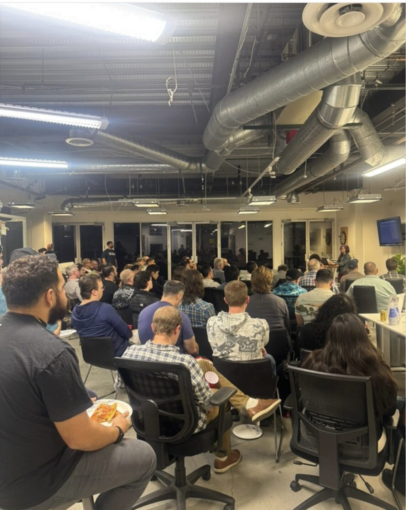

---
theme:
    name: catppuccin-mocha
    override:
        footer:
            style: template
            left: "FFI Playground"
            center: github.com/alycda/RustConf2026
            # right: "Montréal: 2026-09-08"
---

<!-- comment: 08:00 - 09:00 - DOORS -->
<!-- comment: slide_background_color 0b112e -->
<!-- font_size: 7 -->


# Using Advent of Code as an FFI Playground
## RustConf 2026

### Montréal
#### 2026-09-08

##### Alyssa Evans

<!-- no_footer -->

<!-- comment: 09:00 - Part 1 -->

<!-- comment: slot - speaker card -->

<!-- comment: slot - backstory -->

<!-- comment: slot - who am I -->

<!-- comment: slot - why are we here -->

<!-- comment: slot - agenda -->

<!-- comment: slot - self-check -->

<!-- comment: slot - part-1 (why is FFI hard) -->

<!-- comment: slot - exercise-1 (solve it in Rust) -->

<!-- comment: slot - exercise-1-bonus (find a C library, try to load it) -->

<!-- comment: 09:55 - 10:05 - BREAK -->

<!-- comment: 10:05 - Part 2 -->

<!-- comment: slot - lecture-2 (C as the bridge — live demo) -->

<!-- comment: slot - part-2 (wrap it in C) -->

<!-- comment: 10:55 - 11:05 - BREAK -->

<!-- comment: 11:05 - Part 3 -->

<!-- comment: slot - lecture-3 (one header, four runtimes) -->

<!-- comment: slot - part-3 (bindings) -->

<!-- comment: slot - exercise-3-bonus (try another language) -->

<!-- comment: 12:00 - Wrap -->

<!-- comment: slot - debrief -->

<!-- comment: 12:30 - END -->

<!-- end_slide -->

<!-- alignment: center -->


<!-- speaker_note: |

    (30s) Welcome to RustConf 2026 Workshops. I want to thank you all for being here with me today. My name is Alyssa and I'm going to share with you my process on how to break things in Rust while talking to other languages and their runtimes; and to help you choose your own adventure with FFI and Advent of Code.

    -->

<!-- end_slide -->

What Is This?
===



<!-- font_size: 2 -->
<!-- alignment: center -->
Prior Art: [alycda/aoc-ffi](https://github.com/alycda/aoc-ffi) · [alycda/AoC-Ornaments](https://github.com/alycda/AoC-Ornaments)

<!-- end_slide -->

What Is This?
===



<!-- font_size: 2 -->
<!-- alignment: center -->
Prior Art: [alycda/aoc-ffi](https://github.com/alycda/aoc-ffi) · [alycda/AoC-Ornaments](https://github.com/alycda/AoC-Ornaments)

photo: [Lawrence Harvey](https://www.lawrenceharvey.com/newsroom/rust-la-kicks-off-2026-with-a-packed-community-meetup-in-los-angeles)

<!-- end_slide -->

Who Am I?
===


Staff Software Engineer, SDKs at [Ditto](https://ditto.com) 

<!-- speaker_note: |

    Last year I joined Ditto as a Staff Software Engineer. FFI is literally my day job. 
    


    Before Ditto, I spent 6 years in Free Ad-Supported Streaming TV (FAST) 

        building Web Applications for Connected TVs and game consoles. 

        Then I became _that engineer_ who kept pushing to adopt Rust.

    -->

<!-- end_slide -->

Why Are We Here Today?
===

To break things, on purpose; and document the messy middle.

<!-- speaker_note: |

    ## Description

    Using Advent of Code (AoC) puzzles as the substrate, participants build a working Rust FFI library from scratch, wrapping a real AoC solution in a C glue layer and calling it from multiple different target languages. By the end of the workshop, attendees leave with a working multi-language project, a replicable methodology, and hands-on intuition for the pitfalls that make production FFI hard.

    AoC problems are uniquely well-suited for FFI practice because they have diverse input/output types (primitives, strings, iterators), a motivating narrative that makes repetition feel worthwhile, no production baggage — you can break things freely — and progressively increasing complexity across 12-25 days of problems each year. Unlike algorithm-focused competitive programming, this approach uses AoC’s rich problem variety to stress-test real cross-platform FFI patterns: string encoding mismatches between Java and Swift, async model incompatibilities, and the lowest-common-denominator constraints that make production FFI viable.

    ## Learning Outcomes

    After this workshop, attendees will be able to:

    - Use Advent of Code as a structured, low-stakes FFI practice environment — progressing from primitives to strings to async across multiple target languages.
    - Design a C glue layer that accommodates the lowest-common-denominator constraints of diverse language runtimes, using cbindgen or UniFFI.
    - Avoid common FFI pitfalls: string encoding mismatches between Swift/Java, async model incompatibilities, over-exposing Rust idioms that don’t translate across language boundaries.
    - Evaluate whether FFI is the right architectural choice for a given situation, including honest assessment of the maintenance burden, onboarding cost, and performance trade-offs.
    - Replicate the AoC-as-FFI-playground methodology in their own learning or team onboarding — with a structured progression and a working starter template to build from.
  -->

<!-- end_slide -->

Agenda
===

<!-- new_line -->

- **NOW** — self-check + pick your day — *you*
- **9:15** — why FFI is harder than it looks — *me*
- **9:35** — Ex 1 · your day, pure Rust — *you*
- **9:55** — break
- **10:05** — C as the bridge (live demo) — *me*
- **10:25** — Ex 2 · wrap it in a C boundary — *you*
- **10:55** — break
- **11:05** — one header, four runtimes — *me*
- **11:30** — Ex 3 · bindings in YOUR language — *you*
- **12:00** — debrief: what broke? — *all of us*

<!-- end_slide -->

Self-Check
===

```sh
git clone https://github.com/alycda/RustConf2026
cd RustConf2026 # optional: direnv allow
just check # or ./scripts/self-check.sh
```

<!-- new_line -->

<!-- speaker_note: |

 -->

<!-- end_slide -->

Why Is This Hard?
===

An FFI signature is a **treaty** between two runtimes that disagree about memory, types, errors, and encoding —

<!-- new_line -->

and neither side can enforce it.

<!-- speaker_note: |

    (3m) Slow down — this is the thesis of the whole morning.

    The compiler checks YOUR side of the treaty only. We're making a promise to the compiler that we know what we're doing — and we MUST keep it.

    That's why we test from the OTHER side today.

 -->
<!-- end_slide -->

Four Disagreements
===

<!-- incremental_lists: true -->

1. **Memory** — who allocates, who frees, who's *sure*?
2. **Types** — Rust's `String` doesn't exist over there. Neither does `Result`.
3. **Errors** — panics don't cross. Exceptions don't cross. Integers cross.
4. **Encoding** — "it's just a string"

<!-- incremental_lists: false -->

<!-- speaker_note: |

    (5m) After 20 years of breaking things on the internet, encoding bugs are still the ones that ship silently.

    Errors: so what actually crosses the boundary? Integers.

 -->

<!-- end_slide -->

"It's Just a String"
===

<!-- incremental_lists: true -->

* **Rust** — UTF-8; `CString` refuses interior NUL — validation at the boundary
* **C** — bytes + NUL terminator, no promises whatsoever
* **Swift** — UTF-8 inside (since Swift 5); the NSString bridge is UTF-16 — hidden work
* **JVM** — **modified** UTF-8 via JNI. Not quite UTF-8. Really.
* **Python** — unicode object; you `.encode()` first — explicit, honest
* **Dart** — UTF-16 code units; `toNativeUtf8()` — and **you** free it

<!-- incremental_lists: false -->

<!-- speaker_note: |

    (7m) Modified UTF-8: NUL encodes as TWO bytes, and supplementary characters differ too. Works with ASCII in every test — then someone's name has an emoji.

    Sometimes the failure is silent corruption, not a crash. The crash is the easy case.

    ---

    Rust String CAN hold interior NUL — CString is what refuses. Swift String is UTF-8 internally since Swift 5; UTF-16 lives in the ObjC bridge.

 -->

<!-- end_slide -->

Fight the Boundary, Not the Puzzle
===

**AoC gives you:**

* pre-solved problems
* every I/O shape: ints, strings, structs, grids

<!-- new_line -->

**Instead of:**

* fighting the domain AND the boundary
* asymptotic-notation anxiety
* you get to save Christmas instead

<!-- speaker_note: |

    (5m) This is how I reinforced FFI when I joined Ditto: onboarding onto a Rust core serving a dozen platform SDKs, I went back to my AoC solutions and wrapped them in increasingly cursed ways — in public.

    The puzzle is already solved, so every bug is a BOUNDARY bug. That narrows the debugging space to exactly the skill we're here to build.

    Nothing is wasted when you document the messy middle.

 -->

<!-- end_slide -->

Ex 1: Pick Your Day
===

20 min · `exercises/ex1-pure-rust`

<!-- new_line -->

Keep the solver pure: `&str` in, `i64` out — I/O stays **outside** the library

<!-- new_line -->

* ▶ 🥇 **2024-12-03** *Mull It Over* — raw string scan → `usize`; stateful parse (`do()` / `don't()`)
* ▶ **2015-12-06** *Probably a Fire Hazard* — instruction lines → enum + rectangle → `u32`; one 1000×1000 grid, walked twice
* 🥇 **2024-12-01** *Historian Hysteria* — two int lists → `i32`; sort-and-zip, then a frequency map
* **2015-12-01** `()` floor counting · **2015-12-05** nice-string rules
* **2020-12-02** password policies · **2021-12-02** submarine course
* **2022-12-01** calorie sums · **2023-12-01** calibration digits

<!-- new_line -->

▶ the two I walk through · 🥇 golden: verified end to end in all four tracks

<!-- speaker_note: |

    (2m brief, then 20m yours)

    (Survey landed: 2024-12-03 and 2015-12-06 are the two I walk through.
    The rest of the menu is ordered goldens-first behind them.)

    Any day works — the boundary steps are identical. That's the whole methodology.

    The 🥇 rule is earned, not decorative: only days worked end to end in ALL
    four tracks get one, and the two golden days are the only ones that
    qualify — every track CI-verified against numbers the Rust tests pin.

    Launch Ex 1, 20 min. Done early? Help a neighbour — or take the bonus.

    Break at 9:55 — be strict.

    ---

    Menu source of truth: days/README.md in this repo.

 -->

<!-- end_slide -->

Ahead of Schedule? Choose Your Adventure
===

Their boundary was designed for **their** solution — not yours.

<!-- new_line -->

If these puzzles get to be absurd, then so can I with shoving FFI in places it doesn't belong — because guess what inevitably ends up in production?

<!-- new_line -->

<!-- incremental_lists: true -->

* **Banner your answer** — libcaca's FIGlet engine: opaque canvas, a `.flf` font from 1993, a boundary you design (`days/2015-12-01`)
* **JIT your solver** — generate C from your own puzzle input, compile it at runtime with libtcc, benchmark the absurdity (`days/2015-12-01`)
* **Race the sorts** — Rust vs libc `qsort` vs C++ `std::sort` behind a C shim, and the `a - b` comparator that overflows (`days/2024-12-01`)
* **Beat Rust's hash maps with C** — part 2's frequency map through uthash; it wins, and the reason is the lesson (`days/2024-12-01`)
* **Second track** — same day, another language's ceremony
* **Harder shapes** — structs and arrays across the boundary on a tougher day

<!-- incremental_lists: false -->

<!-- speaker_note: |

    (2m)

    This slide only exists if we're ahead — fast room, AI-assisted exercises. Skip it silently otherwise.

    Setup for the second line: all of Eric's puzzles are loosely based on real problems he encountered. So the absurdity is licensed — if the puzzles get to be absurd, so do I. And the punchline is not a joke: the absurd integration is exactly the thing that inevitably ends up in production.

    The point of the menu: crates exist for all of this. Use them at work. Here, design the boundary yourself — that's the durable skill, and it's how you stop inheriting other people's boundary decisions.

    (Show cargo run if the projector allows — the banner earns a laugh)

    ---

    Worked variants on the 2015-12-01 reference branches: libcaca banner (opaque-canvas pattern, CString NUL check, create/free contained) and libtcc JIT + criterion bench. [confirm: final public branch names at publish]

    The two golden-day bullets are validated (2026-08-27, goldens line): the sort race is real (std::sort 1.2x, qsort 3.8x — the comparator overflow shipped live in the original talk and the tests pin i32::MAX/MIN because of it), and uthash at 10.6µs beats ahash's 13.1µs — the debrief line is that crossing frequency, not crossing, is the cost.

    In-repo receipts for "ends up in production" (four-track merge, wip/tracks — pending validation before any of these get named on a slide): the same repo answers AoC puzzles through a speech synthesiser (espeak-ng, 2023-12-01), a malware scanner (YARA, 2023-12-01), a physics engine (Chipmunk2D, 2021-12-02), and a database (DuckDB, 2021-12-02) — every one behind a cargo feature, off by default.

 -->

<!-- end_slide -->

C as the Bridge
===

Module 2 · 10:05

<!-- speaker_note: (back from break — energy reset) -->

<!-- end_slide -->

The Incantation
===

Every word has a job

```rust
#[unsafe(no_mangle)]
pub unsafe extern "C" fn ex_part1(input: *const c_char) -> i64
```

<!-- new_line -->

Design rule: expose the **narrowest surface that works** — what crosses the boundary is what you maintain *forever*.

<!-- speaker_note: |

    Read the signature aloud — every piece has a job. `unsafe` is honest labeling: C++ engineers write unsafe code constantly, they just don't label it. We label it and contain it to ONE file.

    Edition 2024 spells it `#[unsafe(no_mangle)]`: exporting a symbol is an unsafe promise too — a name collision is UB the linker arranges.

    ---

    Signature is exercises/ex2-c-glue/src/lib.rs verbatim (edition 2024 via exercises/Cargo.toml). The worked shape with an out-param instead of an in-band i64: days/2024-12-03/src/c_api.rs.

 -->

<!-- end_slide -->

Live: Rust → Header → C Caller
===

Four commands, one boundary

```sh
cargo build                              # Rust → shared library
cbindgen --output include/ex2_c_glue.h   # Rust → C header (read it!)
cc tests/c/test_glue.c -L target/debug -lex2_c_glue -o test_glue
./test_glue
```

<!-- new_line -->

…then we feed it **garbage** and watch the contract hold.

<!-- speaker_note: |

    The money beat: invalid UTF-8 in, sentinel out, no crash — the boundary checks EARNED that.

    Then the todo!() still inside: a panic across extern "C" aborts. Rust won't let a lie cross the border.

    Read the generated header aloud — it's the demo's centrepiece.

    (Demo-gods fallback: TODO — recorded run or script, staged offline)

    ---

    The four beats are exercises/ex2-c-glue/build-and-test.sh, which calls itself "the same four beats as the Module 2 demo". Trimmed for the slide: the real cc line links against ../target/debug (one cargo workspace) and adds -Wl,-rpath so test_glue runs from any cwd; the library takes the host's name (libex2_c_glue.so / .dylib).

    [confirm: which day's c_api.rs the live demo drives — 2024-12-03 and 2015-12-06 both carry one; ex2's harness is the shape either way]

 -->

<!-- end_slide -->

Ex 2: Panics Don't Cross
===

30 min · `exercises/ex2-c-glue`

<!-- new_line -->

**✗ let it panic** — a panic crossing `extern "C"` **aborts the process** (Rust ≥ 1.81). No stack trace for the caller. Just gone.

<!-- new_line -->

**✓ validate + sentinel** — null check → `CStr` → UTF-8 check → call → in-band error value

<!-- new_line -->

A sentinel is only a sentinel if your day's answers can never **be** it — that proof is about your puzzle, not about C.

<!-- speaker_note: |

    Ex 2 is exactly this: four TODO steps, C harness provided. Step 0 is running the harness before implementing anything — watch the abort once, on purpose.

    Spend one minute reading the generated header — knowing what cbindgen produced is the difference between using it and trusting it.

    Done early? Help a neighbour.

    ---

    ex2 ships INVALID_INPUT = -1 (exercises/ex2-c-glue/src/lib.rs). 2015-12-01 is the counterexample: floors are signed, -1 is a reachable answer, so there -1 is not a sentinel — the slide's last line, in one day.
    Timing valve: this block can run +10 by trimming M3.

 -->
